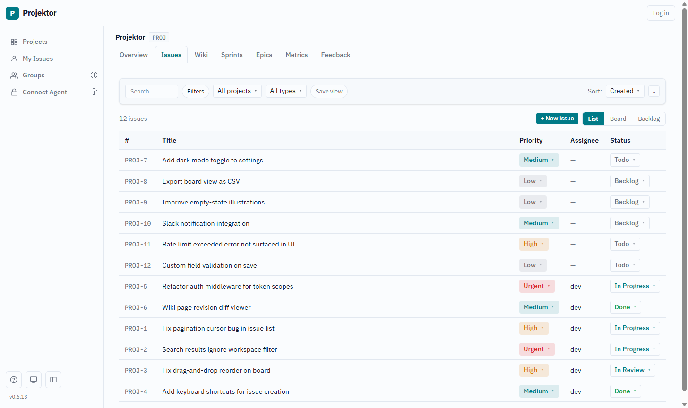

# projektor

[](https://github.com/TAJD/projektor/actions/workflows/ci.yml)
[](https://github.com/TAJD/projektor/releases)
[](./LICENSE)

> An issue tracker and wiki that an AI coding agent runs as a first-class client -
> self-hosted, cross-project, and cheap enough to run serverless.

Projektor fills a gap. Jira and Notion are mature but human-first: agent access is
bolted on, and you can't cheaply self-host a slice of them. Git-file trackers like
beads are agent-native but live inside a single repo. Projektor is agent-native
like beads, deployed and cross-project like Jira, and runs on a single Cloudflare
Worker. Every action a person can take in the browser, an agent can take over MCP -
filing issues, moving tickets, planning sprints, searching the wiki - instead of
asking you to.

**Documentation:** <https://tajd.github.io/projektor/> - self-hosting, connecting an
agent, architecture, and the full MCP tool catalog.

**Live demo:** <https://projektor-demo.tajdickson.workers.dev> - see it running before
you deploy your own ([why there's no login](https://tajd.github.io/projektor/guides/live-demo/)).

## What it is



A complete project tracker - issues, boards, sprints, a wiki - built so an AI agent
can do everything a person can. The shape of the tool follows from that; see
[Agentic workflows](https://tajd.github.io/projektor/agents/agent-workflows/).

- **Issues** - Jira-style tickets: status, priority, assignee, labels, parent/child
  hierarchy, cross-issue links. Referenced as `PROJ-42`.
- **Boards and sprints** - kanban board, list view, sprint planning.
- **Wiki** - nested markdown pages with full-text search and revision history.
- **MCP server** - any MCP agent (Claude Code connects via `claude mcp add`) drives
  the full tool catalog. This is the primary surface, not an add-on.
- **Fleet coordination** - agent registry, file claims, and messages let parallel
  agents work one repo without colliding.
- **Ops** - file attachments (R2), workspace/project/member management with roles
  (`owner`/`admin`/`member`/`viewer`), workspace-scoped API tokens, installable PWA.

Runs on your own Cloudflare account: Hono on Workers, D1 for data, KV for cache,
R2 for attachments. No servers, no containers.

## Self-hosting

projektor deploys to **your own Cloudflare account** from a small **config-only repo**
([`projektor-deploy-example`](https://github.com/TAJD/projektor-deploy-example)) that
downloads a pre-built release artifact - no source checkout, no build step. Three ways
in, easiest first.

### One click

Use the **Deploy to Cloudflare** button in the
[deploy repo](https://github.com/TAJD/projektor-deploy-example): Cloudflare clones it
into your account, **auto-provisions D1, KV, and R2**, and deploys. Fill in your admin
email on the setup page and you're live.

### One command - or one prompt

Clone the deploy repo and run the zero-config script; wrangler auto-provisions the
resources, applies migrations, and deploys:

```bash
PROJEKTOR_REPO=you/projektor ADMIN_EMAILS=you@example.com ./deploy-auto.sh
```

Or hand the repo to an AI agent - *"deploy projektor to my Cloudflare account"* - and
let it run the same flow. See
[AGENT-DEPLOY.md](https://github.com/TAJD/projektor-deploy-example/blob/main/AGENT-DEPLOY.md).

### Then: configure access

The Worker is live, but **Cloudflare Access** must front it before anyone can log in
(a `*.workers.dev` toggle, or a custom domain). Then log in - the first user in
`ADMIN_EMAILS` becomes owner - and mint a token for agents. Full handoff:
[CONFIGURE.md](https://github.com/TAJD/projektor-deploy-example/blob/main/CONFIGURE.md).

### Manual / CI

Prefer to create the resources yourself, keep your config private, or deploy from CI on
every push? See the **[deploy guide](https://tajd.github.io/projektor/guides/deploying/)** for the manual flow, the
Cloudflare API token recipe (it **must include D1**), and push-based auto-updates.

**Updating later:** bump `projektor.version` and re-deploy (or just push, if you wired CI).

## Connect an AI agent

projektor exposes a JSON-RPC 2.0 MCP endpoint at `POST /mcp/<workspaceId>`.
Any MCP-compatible agent (Claude Code, custom agents via the Anthropic SDK) can connect.

### Development - one command

```bash
# Provision workspace + user + token in one shot (dev/staging only)
curl -s "https://<your-worker>.workers.dev/bootstrap" \
  -H "X-Bootstrap-Secret: <your-bootstrap-secret>" \
  | jq -r .mcpAddCommand
```

Pipe the printed command straight into your shell:

```bash
claude mcp add --transport http \
  --header "Authorization: Bearer pk_<64 hex chars>" \
  --header "X-Workspace-Slug: projektor" \
  projektor \
  "https://<your-worker>.workers.dev/mcp/<workspace-uuid>"
```

Once connected, the agent has access to the full tool catalog - create issues, update statuses, search the wiki, plan sprints - anything a browser user can do.

### Production - mint a long-lived token

`/bootstrap` is disabled in production. Instead, log in through Cloudflare Access and
open **Settings → Tokens**: create a token and copy the ready-to-run `claude mcp add`
command shown beside it (token + workspace pre-filled). The full walkthrough - Access
setup, first login, token, MCP - is in
[CONFIGURE.md](https://github.com/TAJD/projektor-deploy-example/blob/main/CONFIGURE.md).

See the **[agent connection guide](https://tajd.github.io/projektor/agents/mcp-connection/)** for the full connection guide, protocol reference, and tool catalog (<!-- gen-mcp-stats:start -->113 tools across 22 domains<!-- gen-mcp-stats:end --> - project data plus agent-coordination primitives).

## Development

```bash
pnpm install

# Copy dev config (one-time)
cp apps/api/.dev.vars.example apps/api/.dev.vars   # set DEV_USER_EMAIL + BOOTSTRAP_SECRET
cp apps/web/.env.example      apps/web/.env        # set PUBLIC_WORKSPACE_SLUG=projektor

pnpm dev   # API on :8787, web on :4321
```

`pnpm dev` automatically applies D1 migrations to the local Miniflare database before starting, so a fresh checkout won't 500 with "no such table".

Seed a local workspace in one shot:

```bash
curl -H "X-Bootstrap-Secret: localdev" http://127.0.0.1:8787/bootstrap
```

Then open **http://localhost:4321** - with `DEV_USER_EMAIL` set, the dev-auth bypass logs you in automatically.

### Tests

```bash
pnpm --filter @projektor/api test   # vitest against an in-process Worker + Miniflare D1
pnpm turbo type-check               # tsc --noEmit across the monorepo
```

Both must be green before opening a PR. CI (`.github/workflows/ci.yml`) runs these plus more -
coverage-enforced test runs, the `@projektor/db` and `@projektor/docs` suites, the web build, and
a generated-docs freshness check. See [AGENTS.md](./AGENTS.md) for the full list.

### Git hooks (lefthook)

`pnpm install` wires two hooks automatically:

- **pre-commit** - `pnpm turbo type-check` (fast; turbo-cached), `pnpm biome check --changed` (lint, changed files only), and the island API convention check
- **pre-push** - `pnpm biome check .`, `pnpm --filter @projektor/api test`, and `pnpm --filter @projektor/web test`

Bypass for WIP commits: `git commit --no-verify -m "wip: …"`

## Architecture (brief)

For a visual of how the system fits together, see the
[architecture overview](https://tajd.github.io/projektor/architecture/system-design/); the deep architecture lives in
[AGENTS.md](./AGENTS.md).

projektor has two surfaces over one service layer:

```
REST  /api/*         ─┐
                       ├─►  services/<domain>.ts  ─►  D1 (SQLite)
MCP   /mcp/:wsId    ─┘
```

Routes and MCP tools are thin wrappers. All business logic and SQL live in `services/`. Both surfaces must stay at parity - adding a feature to only one is a bug.

Runtime: **Hono on Cloudflare Workers** - no Node.js, no containers.
Storage: **D1** (relational), **KV** (cache), **R2** (attachments).
Frontend: **Astro + Preact**, served as static assets via Workers Static Assets; `/api/*` and `/mcp/*` always hit the Worker.

## Roadmap / Contributing

The live projektor dogfood instance tracks feature requests and bugs - projektor is built with itself.

[AGENTS.md](./AGENTS.md) is the contributor guide: conventions, file layout, the service-layer contract, and how to work in parallel without conflicts. Read it before opening a PR.

See [CONTRIBUTING.md](./CONTRIBUTING.md) for how issues and PRs are handled,
[SECURITY.md](./SECURITY.md) to report vulnerabilities, and [AGENTS.md](./AGENTS.md) for
the engineering conventions. Licensed under [MIT](./LICENSE).
