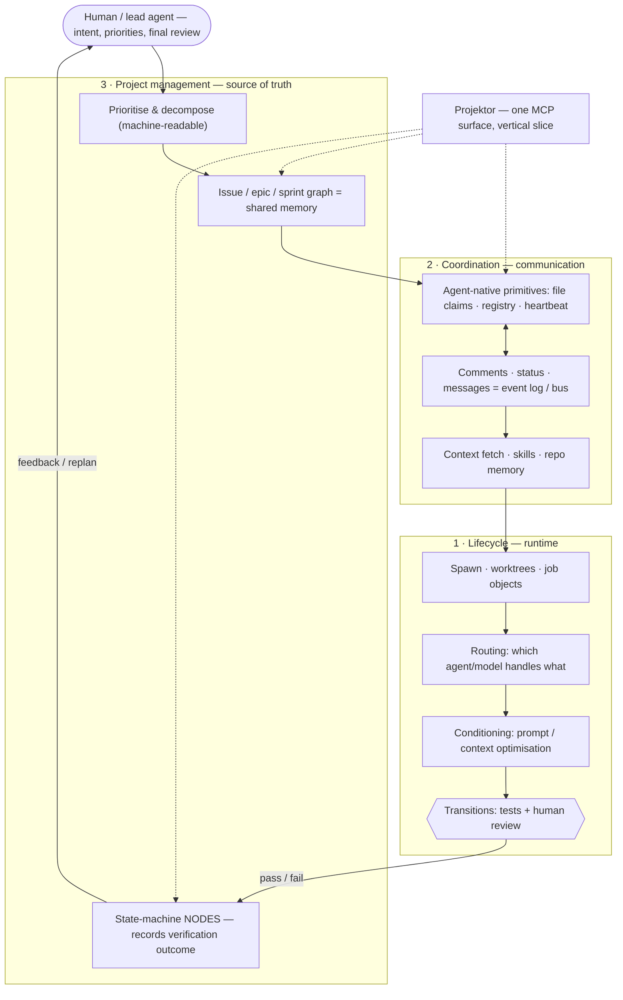

Projektor is **MCP-native**: AI agents are a first-class client, not an afterthought.
Everything a browser user can do, an agent can do over a JSON-RPC MCP endpoint.

Tools for agentic development split into three concerns: running the agents,
coordinating them, and tracking the work. The mistake is to treat each concern as its
own product. They are not products — they are concerns, and the real product boundary
is the API. With MCP as the shared interface, one tool can cut a vertical slice through
several concerns and stay coherent, because the interface stays coherent. That is what
Projektor is: not one layer, but a slice across two of the three.

| Layer | Runs where | What it does | Reference |
|------|-----------|--------------|-----------|
| **1 · Lifecycle** *(implementation)* | The client machine | Spawns an isolated workspace per agent (git worktree + branch + terminal), and reaps it cleanly when done | This page (§1) |
| **2 · Coordination** | Projektor MCP | Lets parallel agents announce themselves, claim files, and message each other so they don't clobber each other's work | [Contributor conventions](/projektor/contributing/conventions/) (Fleet coordination protocol) |
| **3 · Project management** | Projektor MCP | The actual work: issues, sprints, wiki, links — and "what should I work on next?" | [MCP tool catalog](/projektor/agents/tool-catalog/), [Connect an agent](/projektor/agents/mcp-connection/) |

Projektor is a single MCP surface spanning layers 2 and 3. Through file claims it also
reaches into layer 1 — deciding who may write which file. It owns the **nodes** of the
work state machine; the implementation layer owns the **transitions**. Projektor never
runs a test or judges a diff; it records the outcome. You can use any layer alone — a
single agent needs only layer 3 — but the power comes from combining them.



---

## 1 · Lifecycle: one isolated workspace per agent

Before an agent can coordinate, something has to *start* it in a place where it can work
without stepping on other agents or your main checkout. The durable pattern:

- **One git worktree per agent.** Each agent gets its own worktree (e.g. `<repo>.wt/<name>`)
  on its own branch (`wt/<name>`). Worktrees beat branch-switching for parallel AI work:
  every agent edits a physically separate file tree, so there is no "whose turn is it to
  hold the working directory" contention.
- **One terminal/tab per agent**, launched into that worktree. On Windows, wrapping the
  agent's process tree in a Job Object means closing the tab reaps the *whole* dev-stack
  subtree — no orphaned `node`/`workerd` processes holding file locks.
- **Cleanup is close-then-remove, in that order.** The naive approach (delete all the
  worktree directories, then close the tabs) fails on Windows because the OS re-acquires
  directory handles between the two phases. Closing the tab first releases the locks, so
  removing the directory always succeeds. Finish with `git worktree prune`.

> The reference implementation of this layer is a pair of shell scripts (one to
> create a worktree+tab, one to reap them). They are tooling that lives outside this
> repo; the *pattern* — isolated worktree, contained process tree, close-before-remove -
> is what matters and is reproducible with plain `git worktree` and your terminal
> multiplexer of choice.

The trade-off: worktree setup costs ~200–500 ms per agent, so it is not worth it for a
single-file edit. Spin up isolated workspaces when you are fanning out real, parallel work.

---

## 2 · Coordination: parallel agents that don't collide

Once several agents are live in the same repo, they need shared state so two of them don't
edit `routes/mcp.ts` at the same time. Projektor provides three agent-native primitives,
backed by MCP tools:

- **Agent sessions** — `register_agent` / `heartbeat_agent` / `end_agent` / `list_active_agents`.
  Register on start (linking the issue you're implementing), heartbeat ~every 60 s (sessions
  time out after 120 s of silence), end on finish.
- **File claims** — `claim_files` / `release_files` / `list_file_claims`. Claim the paths you're
  about to edit; check who else holds a file before you start; release on completion.
- **Coordination messages** — `post_message` / `list_messages`. Post to an *issue channel* when
  you start, hit a blocker, or finish; post to the *workspace channel* for fleet-wide
  announcements ("rebasing `mcp.ts`, hold off"). Poll with a cursor to read what's new.

The **step-by-step protocol** — exact call order, payloads, and the file-ownership rules
that keep agents on disjoint file sets — lives in
[Contributor conventions → Fleet coordination protocol](/projektor/contributing/conventions/). That's the operational
home; the sections above are the why.

---

## 3 · Project management: the actual work

This is the layer most people start with — and a single agent needs nothing else. Over MCP,
an agent can do everything the UI does: create and triage issues, plan sprints, write wiki
pages, link related issues, manage members. See the full, generated-from-source list in the
[MCP tool catalog](/projektor/agents/tool-catalog/), and [Connect an agent](/projektor/agents/mcp-connection/) to wire one up.

Two tools matter especially for *autonomous* work:

- **`get_prioritized_issues`** — the "what should I work on next?" entry point. Returns open
  issues ranked by a composite score (issue-link-network centrality + priority), so an agent
  can pick the highest-leverage work without a human assigning it.
- **`search_issues` / `search_wiki`** — let an agent ground itself in existing context before
  acting, instead of duplicating work or contradicting documented decisions.

Natural-language prompts that map onto this layer:

> "Show me the highest-priority open issues in PROJ and start on the top one."
> "Create a sprint 'Week 24', move all in-progress and high-priority backlog issues into it."
> "Write a wiki page summarising what we shipped this sprint, using the completed issues as source."

---

## The end-to-end loop

Put the layers together and a parallel coding fleet looks like this:

```
        ┌─ MANAGER ────────────────────────────────────────────────┐
        │ 1. Audit the tracker            get_prioritized_issues   │ (L3)
        │ 2. Batch into agents with       file-ownership rules     │ (L2)
        │    disjoint file sets           in AGENTS.md             │
        └───────────────┬──────────────────────────────────────────┘
                        │ spawn one isolated worktree+tab per agent  (L1)
        ┌───────────────▼──────── WORKER (×N, in parallel) ────────┐
        │ register_agent → claim_files → … work … → post_message   │ (L2)
        │ edit code in its own worktree → open a PR                 │ (L1+L3)
        │ release_files → end_agent                                │ (L2)
        └───────────────┬──────────────────────────────────────────┘
                        │ manager reviews, merges in dependency order,
                        │ deploys, then closes tab + removes worktree  (L1)
                        ▼
                   clean repo state
```

Every arrow crosses a layer boundary, which is exactly why seeing all three at once
matters: the coordination tools (L2) assume something spawned and will reap the agent (L1),
and the work itself (L3) is what the coordination is protecting. Documented in isolation,
each layer looks like a curiosity; together they're a reliable multi-agent dev loop.

---

## Why it's built this way

Projektor sits between two kinds of tool that already exist:

- **Jira / Notion** are mature and scalable, but human-first: agent access is
  bolted on, the API is not the primary surface, and you cannot cheaply
  self-host a slice of them.
- **beads** is genuinely agent-native, but it is a git-file tracker — issues
  stored as JSONL in the repo. That gives offline resilience and issues that
  version alongside the code, but it is structurally per-repo and bound to git
  merges.

Projektor takes the gap between them: **agent-native like beads, deployed and
cross-project like Jira, and cheap enough to run on serverless for a small
project.** When you outgrow it, you swap the database, not the system. Workers
scale compute for free; D1 is the one bottleneck, and replacing it is a swap,
not a rewrite.

| | beads (git-file) | Projektor (deployed) | Jira / Notion |
|---|---|---|---|
| Primary surface | agent-native | agent-native (MCP) | human-first |
| Scope | per-repo | cross-project | cross-project |
| Concurrency | git merge on JSONL | claims · heartbeats | human process |
| Presence / bus | none native | registry + messages | none native |
| Self-host cost | free (no server) | cheap (serverless) | heavy / SaaS |

These are deliberate bets, not oversights:

1. **A central coordinator on the write path.** A deployed tracker puts
   Projektor's availability on every worker's critical path — the price of
   cross-project claims and presence that beads, being offline and git-backed,
   never pays. The bet: fleet-scale coordination is worth more than git's offline
   resilience and the issue-versioned-with-code property.
2. **Task↔code links by convention.** Agents cite an issue's key (e.g. `PROJ-123`)
   in commits, exactly as humans do. That link is grep-able, not queryable — a field
   to add later if it earns its place, not a rewrite.
3. **Coordination, not judgment.** Design, test strategy, and the meaning of
   "done" stay with the engineer. Projektor records the decision; it never makes
   it.

For the research this design draws on, see
[Design principles](/projektor/philosophy/design-principles/).

---

## Where to go next

- **Run a single agent:** [Connect an agent](/projektor/agents/mcp-connection/) → then try the prompts in §3.
- **Run a fleet on this repo:** [Contributor conventions](/projektor/contributing/conventions/) — the coordination
  protocol, serialized-file rules, and per-domain file ownership.
- **Every tool, by domain:** [MCP tool catalog](/projektor/agents/tool-catalog/).
- **The system underneath:** [Architecture](/projektor/architecture/system-design/).
