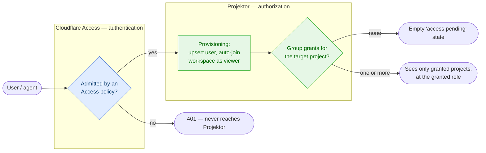
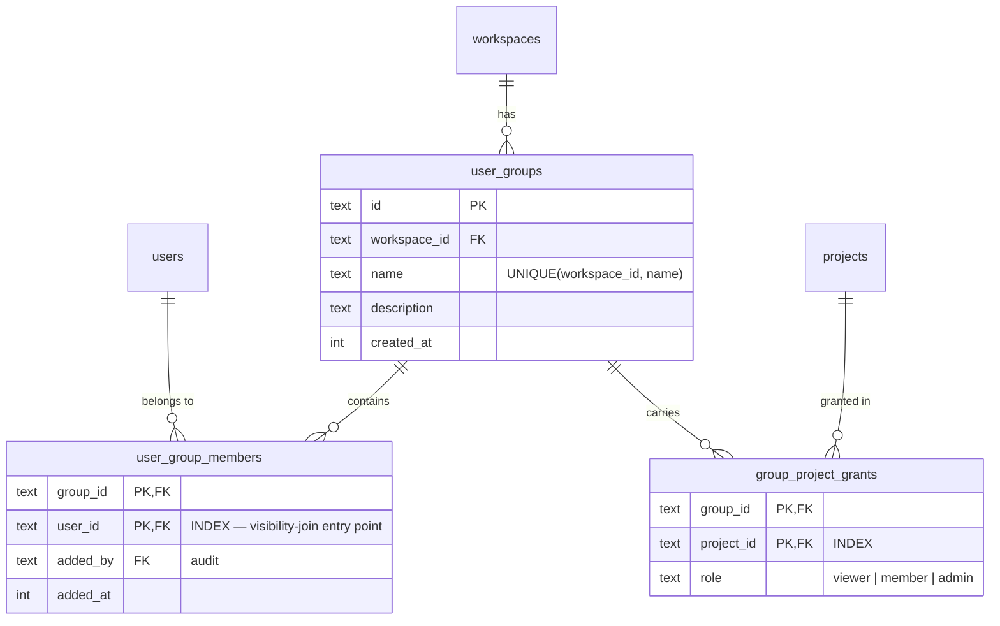
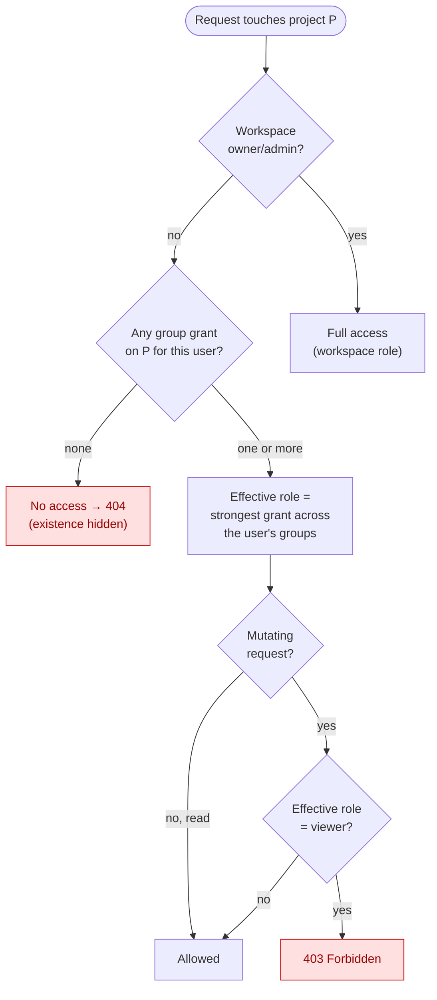
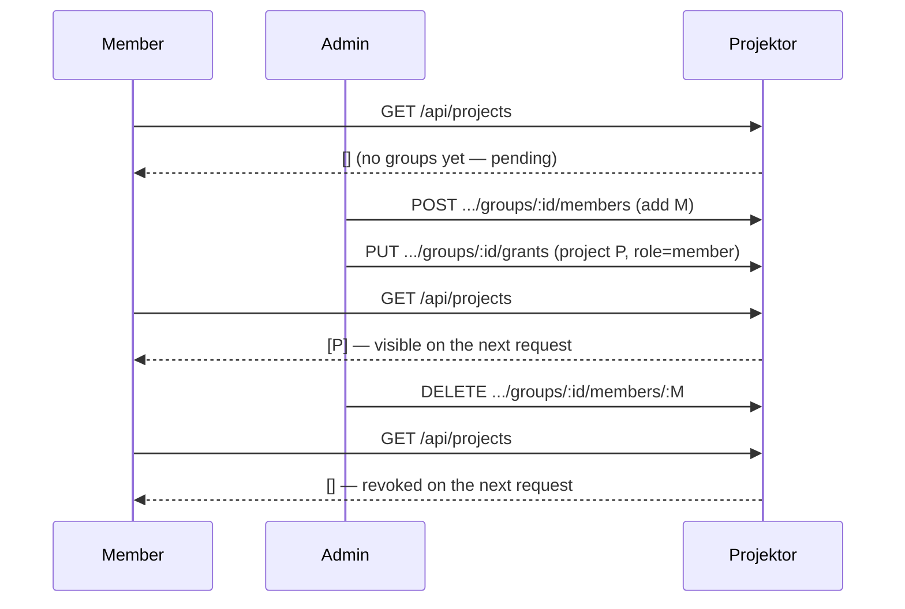

Projektor separates **authentication** from **authorization**. Cloudflare Access
decides *who gets in the door*; Projektor decides *what they can see and do once
inside*. A single Cloudflare Access application fronts a deployment — it is only
the gate. Every access decision below that gate lives in Projektor's service
layer, so it applies identically to a browser session (Access cookie) and to an
agent's API token.

The authorization model is **group-based and default-deny**: a member sees a
project only if one of their groups holds a grant on it.

## The gate vs. the model

A first-time login is admitted by Access, upserted, and auto-joined to the
workspace as a `viewer` **with no groups**. With no grants, the default-deny rule
means they see nothing — no projects, issues, or project wiki — until an admin
adds them to a group. This is the "access pending" state, and it is the whole
point: admission is not access.

Workspace **owner/admin bypass groups entirely** and see everything. This
preserves the `ADMIN_EMAILS` bootstrap and makes lockout impossible — there is
always someone who can hand out the first grant.

## Data model

Three tables carry the model. No `projects.visibility` column exists: every
project is restricted for non-admin members, and visibility is one indexed
`EXISTS` over the join below.

A **group** holds `(project, role)` grants and has a set of members. A user's
visible projects are the union of grants across all groups they belong to.
Deleting a group cascades its memberships and grants; deleting a project or user
cascades the rows that reference it.

## Effective project role

Access is not one bit — each grant carries a role, and the role a user has
*inside* a project can differ from their workspace role. The grant role
**replaces** the workspace role within that project, so a workspace `viewer` can
be a `member` in one project and see nothing in the next.

Two distinctions matter:

- **Strongest wins.** A user in two groups — one granting `viewer`, one granting
  `member` on the same project — gets `member`. Grant roles rank
  `viewer < member < admin`.
- **404 vs. 403.** An *ungranted* project 404s: its existence is never leaked to
  someone who was never given it. A *granted* project the user can see but not
  write to (a viewer grant on a mutation) returns 403 — the resource is known to
  exist, the action is simply refused.

## Enforcement

All of this lives in `apps/api/src/services/access.ts`, and every project-scoped
service routes through it — there is no per-route ACL logic to keep in sync.

| Primitive | Used for | Behaviour for owner/admin |
|-----------|----------|---------------------------|
| `visibleProjectPredicate(ctx, col)` | Filter **list** queries — a drizzle `EXISTS` subquery added to the `WHERE` clause | Returns `undefined` (no filter — see all) |
| `visibleProjectSqlFragment(ctx, expr)` | Same, for hand-written SQL (FTS search, flow metrics) | Returns `null` (no filter) |
| `effectiveProjectRole(ctx, id)` | Resolve a **single** resource; `null` → hidden | Returns the workspace role |
| `requireProjectAccess(ctx, id)` | As above, but throws `NotFoundError` on `null` | Never throws |
| `canWriteProject(role)` | Gate a mutation (`role !== "viewer"`) | Always writable |

The visibility check is deliberately an **indexed `EXISTS`** join
(`user_group_members ⋈ group_project_grants`) rather than fetching a list of
project ids and binding them — that keeps it a single query and avoids D1's
100-bind-parameter ceiling on workspaces with many projects.

Coverage spans every project-scoped surface: projects, issues, sprints, wiki
(project-scoped pages; workspace-level pages stay visible to all members),
comments, issue links, flow metrics, and project activity.

### Per-request, no session state

Visibility is recomputed from the tables on **every request**. There is no cached
permission set to invalidate, so a membership or grant change takes effect on the
user's very next request.

## Managing groups

Group, membership, and grant management is a first-class domain — REST endpoints
under `/api/workspaces/:slug/groups` and matching MCP tools (`create_group`,
`add_group_member`, `set_group_grant`, …) at parity. All of it is
**owner/admin-only**; ordinary members can see only their own groups.

| Action | Who |
|--------|-----|
| Create / rename / delete groups | owner, admin |
| Add / remove group members | owner, admin |
| Add / edit / remove project grants | owner, admin |
| View all groups & memberships | owner, admin (members see only their own) |

In the browser this is the **Groups** settings screen: a members overview (group
chips per member, a "pending — no access" badge for the ungrouped) plus a
per-group editor for members and project grants. The same loop is fully available
over MCP, so an agent can provision access end-to-end.

## Migration & compatibility

Turning on default-deny would blank out every existing non-admin member. The
migration (`0027_user_groups`) avoids that: it creates an **`all-projects`** group
per workspace, grants it `member` on every existing project, and adds all current
non-admin members to it — so existing visibility is preserved exactly. New users
after the migration get the pending flow instead.

:::caution[Privilege note]
The backfill grants `member` (not `viewer`) on the all-projects group, so an
existing workspace *viewer* becomes a per-project *member*. This follows the
"preserve current visibility" requirement, but it is a small privilege widening
worth a conscious sign-off when adopting the feature.
:::

Provisioning stays `onConflictDoNothing` and never touches groups, so a returning
user re-logging in never has their admin-assigned groups clobbered.

## Out of scope

Deliberately not in this iteration: IdP/Entra group claims auto-assigning groups
from the Access JWT, project-scoped API tokens, per-issue or per-page ACLs, and
admin notifications for pending users (the badge is the only signal in v1).
