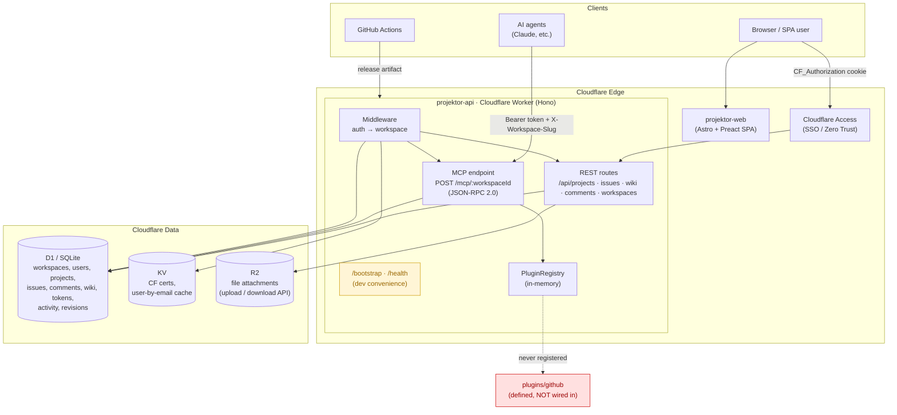

import mcpStats from "../../../generated/mcp-stats.json";

> Wiki + Jira-style issue tracker built MCP-native, running entirely on Cloudflare's edge.
> Monorepo (pnpm + turbo).

This page maps how Projektor is actually built - its surfaces, service layer, and
storage - including what is wired up and what isn't yet. It describes the system as
it stands today, not an idealised summary.

## How it works

Projektor runs as a **single Cloudflare Worker** (`apps/api`, built on Hono). That one
Worker exposes two surfaces over a shared request pipeline: a **REST API** for the
browser SPA, and an **MCP endpoint** (JSON-RPC 2.0) that is the primary
surface for AI agents. Every request flows through auth middleware - Cloudflare Access
JWTs for human browser sessions, hashed API tokens for agents - and then workspace
middleware that resolves the tenant from the slug and verifies membership before any
handler runs.

State lives entirely on Cloudflare's edge. **D1** (SQLite) holds the relational data -
workspaces, users, projects, issues, comments, wiki pages, tokens, activity, and
revisions. **KV** caches Access certs and email lookups. **R2** holds
file attachments. There are no servers and no containers: the whole system deploys as a
Worker plus its bound data stores, which is what makes a five-minute self-host possible.

The sections below give the picture in increasing detail - first a diagram, then a
layer-by-layer breakdown, then the request flow through a single agent call.

## System diagram

## Layer breakdown

| Layer | Tech | Package | Notes |
|-------|------|---------|-------|
| Frontend | Astro + Preact | `apps/web` | Full SPA - issues, board, sprints, wiki, settings, tokens. Dev-proxies `/api` + `/mcp` to `:8787`. |
| API / edge runtime | Hono on Cloudflare Workers | `apps/api` | REST + MCP, two-mode auth, workspace tenancy. |
| MCP server | JSON-RPC 2.0 over HTTP | `apps/api/src/routes/mcp.ts` | {mcpStats.tools} tools across {mcpStats.domains} domains (coordination + project data). Primary surface. |
| Plugin system | Registry + SDK | `apps/api/src/plugins`, `packages/plugin-sdk` | `definePlugin` / `defineMCPTool`. **Not loaded at runtime.** |
| Data model | Drizzle ORM → D1 | `packages/db` | Drizzle is the schema and primary query layer; raw `DB.prepare` remains in the auth/workspace middleware hot path, the dev bootstrap, and a handful of service queries (FTS, counters) where hand-written SQL is clearer. |
| Shared types | TS | `packages/types` | `HonoEnv`, `Plugin`, `MCPTool`, `PluginContext`. |
| Auth | CF Access JWT (RS256) + API tokens (SHA-256) | `middleware/auth.ts` | Plus dev bypass via `DEV_USER_EMAIL`. |
| Deploy | wrangler + GitHub Actions | `projektor-deploy-example` | projektor publishes a release artifact; a config-only deploy repo downloads + ships it (no submodule). |

## API surfaces

REST (`/api/*`) is the SPA's **private contract** - versionless, and may change shape
between releases without notice. MCP (`/mcp/:workspaceId`) is the **stable public
surface** for agents. The two are usually kept at parity (see `AGENTS.md`'s
service-layer contract), but a small, documented subset of REST endpoints - file
attachments, tokens, public share links, feedback submission - has no MCP
equivalent and is safe to depend on; see [REST endpoints](/projektor/agents/rest-endpoints/).

## Request flow

1. **Agent** → `POST /mcp/:workspaceId` with `Authorization: Bearer pk_…` + `X-Workspace-Slug`.
2. `authMiddleware`: CF Access JWT → API-token (D1 hash lookup) → dev bypass.
3. `workspaceMiddleware`: resolve slug → load workspace → verify `workspace_members` row.
4. MCP router dispatches `initialize` / `tools/list` / `tools/call` → core tool handler → D1.

Workspace membership is only the outer gate. Which *projects* a member can see and
what they can do inside them is decided per-request in the service layer — see
[Access control](/projektor/architecture/access-control/).
