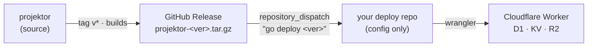

Projektor ships as a **self-contained release artifact** and deploys from **config
only**. There is no source checkout, no submodule or any build step on the machine that
deploys. This page describes how the deployment process works: the model, how to stand up your own
instance, how releases are cut, and how to keep an instance updated automatically.

> Looking for the 5-minute version? See [Self-hosting](/projektor/guides/self-hosting/).
> A ready-to-fork template lives at
> [github.com/TAJD/projektor-deploy-example](https://github.com/TAJD/projektor-deploy-example) -
> including a **Deploy to Cloudflare** button and a zero-config `deploy-auto.sh` (plus
> `AGENT-DEPLOY.md` / `CONFIGURE.md`) that auto-provision D1/KV/R2 with no manual setup.
> This page is the manual / CI reference.

## The model

Three repositories, with a clean producer → consumer split:



- **`projektor`** - the source. Tagging `v*` builds a release artifact and publishes
  it to a GitHub Release. Stays generic: it knows nothing about any particular
  deployment.
- **Your deploy repo** - holds *only* configuration: a `wrangler.toml` with your
  Cloudflare resource IDs, a pinned `projektor.version`, and a deploy workflow.
  [`projektor-deploy-example`](https://github.com/TAJD/projektor-deploy-example) is
  the public template; copy it.

The deploy machine needs only **`wrangler`** and **`gh`** - never `pnpm`,
`node_modules`, or the projektor source.

## What's in a release

Each `projektor-<version>.tar.gz`, extracted into `./vendor`:

| Path | Contents |
|------|----------|
| `vendor/worker.js` | the entire Worker, bundled and self-contained (Hono, Drizzle, all deps inlined - only `node:*` builtins remain, provided by `nodejs_compat`) |
| `vendor/web/` | the pre-built frontend, served as static assets |
| `vendor/migrations/` | D1 migrations |
| `vendor/wrangler.example.toml` | the config template (`compatibility_date` baked from source) |
| `vendor/VERSION` | the version string |

These four travel together at one version - a migration, the code that reads it,
and the frontend that calls it are always in lockstep.

## Deploy your own instance

### 1. Fork the deploy example

The recommended path is to **fork
[`projektor-deploy-example`](https://github.com/TAJD/projektor-deploy-example)** -
your fork becomes the deploy repo.

```bash
gh repo fork TAJD/projektor-deploy-example --clone
cd projektor-deploy-example
```

> A fork is public. If you want your config (resource IDs) kept private, create
> from the template instead:
> `gh repo create my-projektor-deploy --private --template TAJD/projektor-deploy-example`.

### 2. Provision Cloudflare resources

```bash
wrangler d1 create projektor
wrangler kv namespace create projektor
wrangler r2 bucket create projektor-files
```

### 3. Configure `wrangler.toml`

Pin a version and run the deploy script once - it downloads the release and
scaffolds your `wrangler.toml` from the template:

```bash
gh release list -R TAJD/projektor          # find a real tag - releases are all v0.x so far
echo "v0.3.7" > projektor.version          # pin whichever tag you picked
./deploy.sh                                 # creates wrangler.toml, then asks you to fill it
```

Fill in the `REPLACE_` values: D1 `database_id`, KV `id`, your Cloudflare Access
team domain + audience, and `ADMIN_EMAILS`. The artifact-owned paths
(`main = ./vendor/worker.js`, `[assets].directory = ./vendor/web`,
`migrations_dir = ./vendor/migrations`) and `compatibility_flags = ["nodejs_compat"]`
are already set - leave them.

### 4. Cloudflare API token - include D1

This is the step that most often goes wrong. **Do not** use Cloudflare's built-in
"Edit Cloudflare Workers" token template: it omits D1, so `wrangler deploy`
succeeds but `wrangler d1 migrations apply` fails with an auth error.

Create a **Custom Token** (My Profile → API Tokens → Create Token → Create Custom
Token) with:

| Type | Permission | Access |
|------|-----------|--------|
| Account | Workers Scripts | Edit |
| Account | **D1** | **Edit** |
| Account | Workers KV Storage | Edit |
| Account | Workers R2 Storage | Edit |
| Account | Account Settings | Read |

- **Account Resources:** Include → your account.
- **Zone Resources:** none needed on `*.workers.dev`. Add `Zone → Workers Routes →
  Edit` (scoped to your zone) only if you serve on a custom domain.

Verify it before wiring CI:

```bash
CLOUDFLARE_API_TOKEN=xxx CLOUDFLARE_ACCOUNT_ID=yyy wrangler d1 list   # must succeed
```

If `d1 list` errors, the token is missing the D1 permission.

### 5. Secrets

**GitHub Actions** (your deploy repo → Settings → Secrets and variables → Actions):

| Secret | Purpose |
|--------|---------|
| `CLOUDFLARE_API_TOKEN` | the custom token from step 4 |
| `CLOUDFLARE_ACCOUNT_ID` | target account (`wrangler whoami`) |
| `PROJEKTOR_RELEASE_PAT` | only if `projektor` is **private** - a fine-grained PAT with `Contents: Read` on it, so CI can download the release asset. For a public projektor, use the built-in `GITHUB_TOKEN` instead. |

**On the Worker** (set once; persists across every deploy - *not* a GitHub secret):

```bash
wrangler secret put JWT_SECRET     # any long random string, used to sign API tokens
```

CI never manages runtime secrets - it only needs the deploy token. Rotating
`JWT_SECRET` invalidates existing API tokens, so set it once and leave it.

### 6. Deploy

```bash
./deploy.sh          # locally (wrangler OAuth), or
git push             # CI deploys on push to main
```

## How a deploy works

`deploy.sh` is the whole contract - it runs identically locally and in CI:

```bash
gh release download "$(cat projektor.version)" -R OWNER/projektor -p 'projektor-*.tar.gz'
tar -xz -C vendor                                    # extract artifact
wrangler d1 migrations apply projektor --remote      # idempotent; only new migrations run
wrangler deploy                                       # upload worker + assets
```

Your `wrangler.toml` points `main`, `[assets].directory`, and `migrations_dir` at
`./vendor/...`, which the extract step populates. `vendor/` is gitignored.

## Upgrade notes

**Subdomain-based workspace routing is now opt-in.** Set `WORKSPACE_SUBDOMAIN_ROUTING=true`
if you rely on subdomain-based tenant routing; otherwise clients must send the
`X-Workspace-Slug` header.

## Cutting a release (maintainers)

Releases are tag-driven. From the `projektor` repo:

```bash
git tag v1.2.0 && git push --tags
```

`.github/workflows/release.yml` then builds the artifact (web build → bundle worker
→ collect migrations → write `wrangler.example.toml`) and publishes a GitHub
Release with `projektor-v1.2.0.tar.gz` attached.

## Automatic updates

An instance can track the latest release automatically - push-based, so a new
release deploys within seconds and the producer stays generic.

How it's wired:

1. In `projektor`, set a repository **variable** `DEPLOY_DISPATCH_REPO` to your
   deploy repo (e.g. `YOU/my-projektor-deploy`) and add a `WORKSPACE_PAT` secret
   that can POST dispatches to it:
   - **Classic PAT:** the `repo` scope.
   - **Fine-grained PAT:** the deploy repo must be in *Repository access* **and**
     the token must grant *Repository permissions → Contents: Read and write* -
     you need **both**. Granting the permission without selecting the repo (or vice
     versa) silently fails.

   > **Gotcha:** if the PAT can't see the repo or lacks `Contents: write`, the
   > dispatch fails with **HTTP 404 "Not Found"** - *not* 403. GitHub masks a
   > permission failure as a missing resource, so a 404 on the dispatch step means
   > "fix the PAT's repo access / Contents permission," not "wrong URL."

   The release workflow's final step fires a `repository_dispatch`
   (`projektor-release`, payload `version`) - but only if `DEPLOY_DISPATCH_REPO`
   is set, so projektor remains generic for everyone else.
2. Your deploy workflow listens for that dispatch, records the released tag into
   `projektor.version` (a `[skip ci]` commit), and deploys.

The result: `git push --tags` in `projektor` → your instance is running the new
version, no manual step. To deploy by hand instead, just bump `projektor.version`,
commit, and push.

## Operating notes

- **Roll out a specific version:** `echo "v1.3.0" > projektor.version && git commit -am … && git push`.
- **Migrations** apply automatically on every deploy and are idempotent - only
  unapplied ones run (`✅ No migrations to apply!` when there are none).
- **Deploy triggers** are scoped: the deploy workflow runs on changes to
  `projektor.version`, `wrangler.toml`, `deploy.sh`, or the workflow itself - so
  documentation edits don't trigger redeploys, but version bumps do.
- **Releases & changelog:** every tagged release is listed at
  [github.com/TAJD/projektor/releases](https://github.com/TAJD/projektor/releases).

## Troubleshooting

| Symptom | Cause / fix |
|---------|-------------|
| `wrangler d1 migrations apply` fails with an auth error | The API token is missing **D1: Edit** (the "Edit Cloudflare Workers" template omits it). Recreate as a custom token; verify with `wrangler d1 list`. |
| `Wrangler requires at least Node.js v22` | Your workflow uses an older Node. wrangler 4.x needs **Node ≥ 22** - set `node-version: '22'` in `setup-node`. |
| Release published but the instance didn't auto-deploy | The `DEPLOY_DISPATCH_REPO` variable is unset, or `WORKSPACE_PAT` can't dispatch to the deploy repo. The dispatch step fails with **HTTP 404** (GitHub masks a permission failure as "Not Found"). Fix: a fine-grained `WORKSPACE_PAT` needs the deploy repo selected in *Repository access* **and** *Contents: Read and write*. |
| `gh release download` 404 in CI | `projektor` is private and `PROJEKTOR_RELEASE_PAT` (with `Contents: Read`) is missing or expired. |
| Auto-bump commit triggers a second deploy | The bump commit must include `[skip ci]` and be pushed by `GITHUB_TOKEN` (which doesn't re-trigger workflows). |
