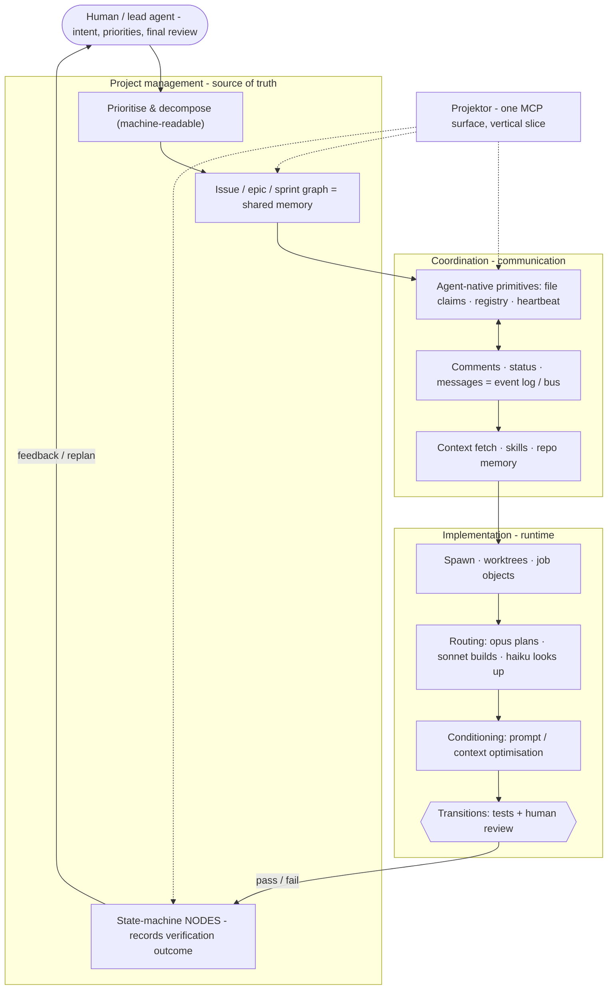

COMMENT: This doesn't necessarily frame the problem in the right way at the moment.

- Human vs agent split
- Developer processes -> how the developer or agent does this
- Developer to implementation co-ordination -> defining what a task is and what files is needs to use
- Product perspective and project management -> wikis, epics and task generation

Tools break down how they help in various different ways depending on the opinion of the developer vision.

- Any tool has to be MCP first.
- Traditional project management processes around wikis, tasks and sprints and epics are scalable and enable Agents to focus on product level concerns over meaningful timeframes. These still group increments of work usefully.
- Cloudflare has insane free tiers, and I also thought it would be an interesting project to build my own tooling.

COMMENT: This should be removed or updated, the selling point of this tool is that it's AI native, free or cheap to host and has a very easy deployment process. It also is positions at the nexus of project management and agent orchestration without defining the models or how the agents are orchestrated.

## The empty middle

Projektor sits between two kinds of tool that already exist:

- **Jira / Notion** are mature and scalable, but human-first: agent access is
  bolted on, the API is not the primary surface, and you cannot cheaply
  self-host a slice of them.
- **beads** is genuinely agent-native, but it is a git-file tracker - issues
  stored as JSONL in the repo. That gives offline resilience and issues that
  version alongside the code, but it is structurally per-repo and bound to git
  merges.

Projektor takes the gap between them: **agent-native like beads, deployed and
cross-project like Jira, and cheap enough to run on serverless for a small
project.** When you outgrow it, you swap the database, not the system. Workers
scale compute for free; D1 is the one bottleneck, and replacing it is a swap,
not a rewrite.

| | beads (git-file) | Projektor (deployed) | Jira / Notion |
|---|---|---|---|
| Primary surface | agent-native | agent-native (MCP) | human-first |
| Scope | per-repo | cross-project | cross-project |
| Concurrency | git merge on JSONL | claims · heartbeats | human process |
| Presence / bus | none native | registry + messages | none native |
| Self-host cost | free (no server) | cheap (serverless) | heavy / SaaS |

## Honest tradeoffs

These are deliberate bets, not oversights:

1. **A central coordinator on the write path.** A deployed tracker puts
   Projektor's availability on every worker's critical path - the price of
   cross-project claims and presence that beads, being offline and git-backed,
   never pays. The bet: fleet-scale coordination is worth more than git's offline
   resilience and the issue-versioned-with-code property.
2. **Task↔code links by convention.** Agents cite `PROJ-123` in commits, exactly
   as humans do. That link is grep-able, not queryable - a field to add later if
   it earns its place, not a rewrite.
3. **Coordination, not judgment.** Design, test strategy, and the meaning of
   "done" stay with the engineer. Projektor records the decision; it never makes
   it.

## Where to go next

- **The operational loop:** [Agentic workflows](/projektor/agents/agent-workflows/) - how the
  three concerns combine into a real multi-agent dev cycle.
- **The system underneath:** [Architecture](/projektor/architecture/system-design/).
- **Connect an agent:** [Connect an AI agent](/projektor/agents/mcp-connection/).
