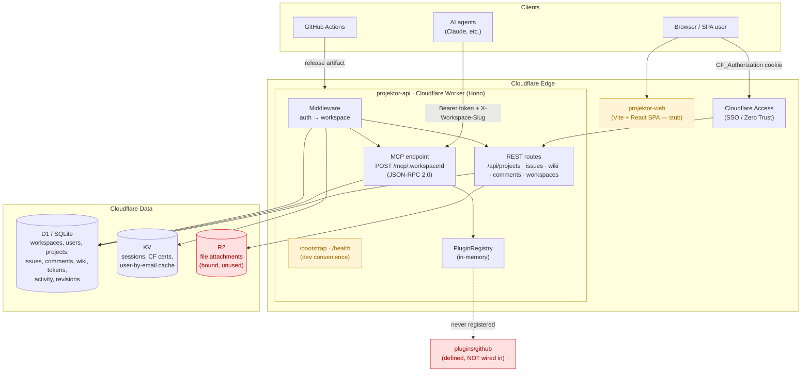

# Projektor — Marketecture

> Wiki + Jira-style issue tracker built MCP-native, running entirely on Cloudflare's edge.
> Monorepo (pnpm + turbo). Generated 2026-06-22.

## System diagram



## Layer breakdown

| Layer | Tech | Package | Notes |
|-------|------|---------|-------|
| Frontend | Vite + React 18 | `apps/web` | **Stub** — single static `<h1>`. Dev-proxies `/api` + `/mcp` to `:8787`. |
| API / edge runtime | Hono on Cloudflare Workers | `apps/api` | REST + MCP, two-mode auth, workspace tenancy. |
| MCP server | JSON-RPC 2.0 over HTTP | `apps/api/src/routes/mcp.ts` | 64 tools across 14 domains (coordination + project data). Primary surface. |
| Plugin system | Registry + SDK | `apps/api/src/plugins`, `packages/plugin-sdk` | `definePlugin` / `defineMCPTool`. **Not loaded at runtime.** |
| Data model | Drizzle ORM → D1 | `packages/db` | 11 tables, 1 migration. Raw `c.env.DB.prepare` used everywhere — Drizzle is schema-only. |
| Shared types | TS | `packages/types` | `HonoEnv`, `Plugin`, `MCPTool`, `PluginContext`. |
| Auth | CF Access JWT (RS256) + API tokens (SHA-256) | `middleware/auth.ts` | Plus dev bypass via `DEV_USER_EMAIL`. |
| Deploy | wrangler + GitHub Actions | `projektor-deploy-example`, `projektor-workspace` | projektor publishes a release artifact; a config-only deploy repo downloads + ships it (no submodule). |

## Request flow

1. **Agent** → `POST /mcp/:workspaceId` with `Authorization: Bearer pk_…` + `X-Workspace-Slug`.
2. `authMiddleware`: CF Access JWT → API-token (KV session cache → D1 hash lookup) → dev bypass.
3. `workspaceMiddleware`: resolve slug → load workspace → verify `workspace_members` row.
4. MCP router dispatches `initialize` / `tools/list` / `tools/call` → core tool handler → D1.

---

# Areas for improvement / development

### 🔴 Correctness gaps (things that are wired but don't work)

1. **The plugin system is dead code.** `pluginRegistry` is an in-memory `Map` that is *never* populated — nothing calls `register()` or `enableForWorkspace()` at worker startup, and the `enabled_plugins` D1 table is never read. `plugins/github` is defined but unreachable. Either wire a bootstrap that loads enabled plugins per request from D1, or cut the package until it's real. (In-memory registry also won't survive across Worker isolates anyway.)

2. **Plugin migrations have no runner.** `Migration[]` is declared on plugins but nothing executes the SQL. A plugin's tables will never exist.

3. **API-token workspace scope is captured but ignored.** `auth.ts` sets `tokenWorkspaceId` from the token row, but `workspaceMiddleware` resolves the workspace purely from the `X-Workspace-Slug` header + membership check. A token minted for workspace A works against workspace B if the user belongs to both. Scope tokens to their workspace.

4. **`scopes` (read/write) are never enforced.** Tokens carry `["read","write"]` but no handler checks them, and roles (`owner/admin/member/viewer`) are loaded into context then never used for authorization. All members can mutate everything.

### 🟠 Security hardening

5. **CORS is `origin: '*'` with `Authorization` allowed.** Fine for a pure token API, but tighten before any cookie-based browser flow goes live.
6. **`/bootstrap` mints an owner token from an unauthenticated GET.** Gated on `ENVIRONMENT !== 'production'` only — make sure prod env var can never be misset, or require a setup secret.
7. **No rate limiting** on token auth or MCP calls — trivial to brute-force/abuse at the edge. Consider CF rate-limiting rules or a KV counter.
8. **`String(err)` leaked to MCP clients** (`-32000` path) can expose internals; log server-side, return a generic message.

### 🟡 Architecture & consistency

9. **Drizzle is declared but unused at runtime.** Every handler hand-writes `DB.prepare(...)` SQL with manual `?` binding and JSON `stringify`/`parse`. You're paying for Drizzle (schema, migrations) but get none of its type-safety on reads. Pick one: use Drizzle queries, or drop it to a migration-only dep.
10. **Duplicated logic between REST and MCP.** Issue/wiki/project CRUD is implemented twice with subtly different shapes (e.g. MCP `create_issue` defaults `status='backlog'`, REST validates with Zod; MCP has no Zod validation). Extract a shared service/`packages/core` layer both call.
11. **No input validation on MCP tool args** — handlers `as`-cast `unknown`. A shared validation layer (reuse the Zod schemas) would close this and #10 together.
12. **Inline workspace handlers in `index.ts`.** `/api/workspaces` GET/POST are implemented inline "to avoid double-mounting confusion" while a `workspacesRouter` also exists — confusing. Consolidate.
13. **`activity` table is written by nobody.** Audit log schema exists but no handler inserts rows. Wire it into create/update paths or remove.
14. **R2 bound but unused.** No attachment upload/download endpoints exist yet — natural next feature.

### 🟢 Product / dev-experience

15. **Web app is a stub.** The whole UI is a placeholder `<h1>`. The product is currently MCP-only. Biggest growth area if a human UI is intended.
16. **Test coverage is thin.** Only `health`, `issues`, `wiki`, `mcp` have tests; no coverage for auth, workspace tenancy, plugins, or token lifecycle — exactly the security-sensitive code.
17. **No OpenAPI / MCP tool catalog doc.** A generated reference would help agent integrators.
18. **Wiki search is `LIKE '%q%'`.** Fine at small scale; consider D1 FTS5 as content grows.
```
