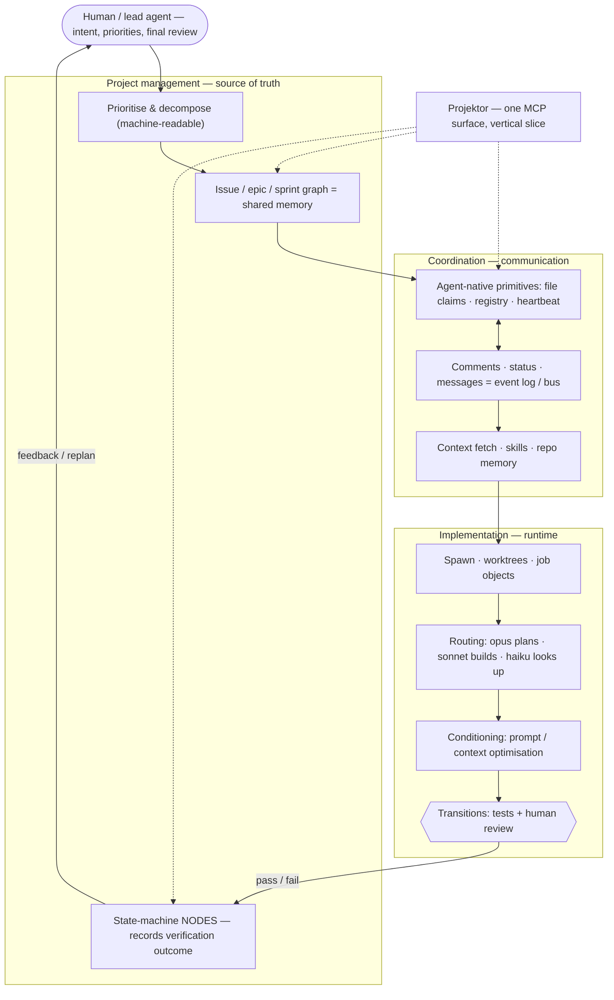

# Philosophy: where Projektor fits

Tools for agentic development split into three concerns: running the agents,
coordinating them, and tracking the work. The mistake is to treat each concern
as its own product. They are not products — they are concerns, and the real
product boundary is the API. With MCP as the shared interface, one tool can cut
a vertical slice through several concerns and stay coherent, because the
interface stays coherent. That is what Projektor is: not one layer, but a slice
across several.

This page is the *why*. For the *how* — the multi-agent loop these concerns
combine into — see [Agentic workflows](./agent-workflows.md).

## The three concerns

1. **Implementation — the runtime.** Spawning agents, worktrees, job objects.
   Choosing which model runs (Opus plans, Sonnet builds, Haiku looks up). Tuning
   prompts and context to keep tokens cheap. And the verification steps that move
   work forward: running the tests, doing the human review.
2. **Coordination — communication.** A message bus, agent presence, context
   fetching, shared skills. For a fleet, most of this collapses into project
   management: the issue graph **is** the shared memory, and status changes
   **are** the events.
3. **Project management — the source of truth.** The durable state: the issue,
   epic, and sprint graph; machine-readable priorities; and the state-machine
   nodes that record what verification decided.

Projektor is a single MCP surface spanning coordination and project management.
Through file claims it also reaches into the runtime — deciding who may write
which file. It owns the **nodes** of the work state machine; the implementation
layer owns the **transitions**. Projektor never runs a test or judges a diff. It
records the outcome.

## The empty middle

Projektor sits between two kinds of tool that already exist:

- **Jira / Notion** are mature and scalable, but human-first: agent access is
  bolted on, the API is not the primary surface, and you cannot cheaply
  self-host a slice of them.
- **beads** is genuinely agent-native, but it is a git-file tracker — issues
  stored as JSONL in the repo. That gives offline resilience and issues that
  version alongside the code, but it is structurally per-repo and bound to git
  merges.

Projektor takes the gap between them: **agent-native like beads, deployed and
cross-project like Jira, and cheap enough to run on serverless for a small
project.** When you outgrow it, you swap the database, not the system. Workers
scale compute for free; D1 is the one bottleneck, and replacing it is a swap,
not a rewrite.

| | beads (git-file) | Projektor (deployed) | Jira / Notion |
|---|---|---|---|
| Primary surface | agent-native | agent-native (MCP) | human-first |
| Scope | per-repo | cross-project | cross-project |
| Concurrency | git merge on JSONL | claims · heartbeats | human process |
| Presence / bus | none native | registry + messages | none native |
| Self-host cost | free (no server) | cheap (serverless) | heavy / SaaS |

## Honest tradeoffs

These are deliberate bets, not oversights:

1. **A central coordinator on the write path.** A deployed tracker puts
   Projektor's availability on every worker's critical path — the price of
   cross-project claims and presence that beads, being offline and git-backed,
   never pays. The bet: fleet-scale coordination is worth more than git's offline
   resilience and the issue-versioned-with-code property.
2. **Task↔code links by convention.** Agents cite `PROJ-123` in commits, exactly
   as humans do. That link is grep-able, not queryable — a field to add later if
   it earns its place, not a rewrite.
3. **Coordination, not judgment.** Design, test strategy, and the meaning of
   "done" stay with the engineer. Projektor records the decision; it never makes
   it.

## Where to go next

- **The operational loop:** [Agentic workflows](./agent-workflows.md) — how the
  three concerns combine into a real multi-agent dev cycle.
- **The system underneath:** [Architecture](./architecture.md).
- **Connect an agent:** [Connect an AI agent](./mcp.md).
